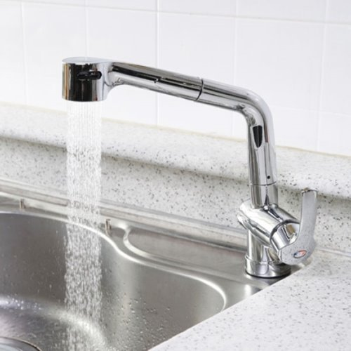
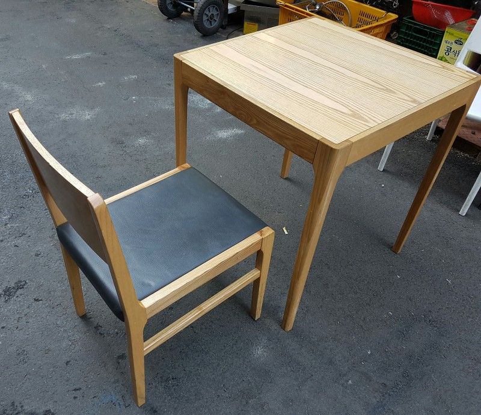

# [Index]

1. [컨셉](#컨셉)  
2. [관련 이미지 & 동영상](#관련-이미지--동영상)  
3. [대표 이미지](#대표-이미지)  
4. [컨셉 & 대표 이미지 기반 작품묘사](#컨셉--대표-이미지-기반-작품묘사)  
5. [게임 구성 요소](#게임-구성-요소)  
6. [게임 시스템 디자인](#게임-시스템-디자인)  
    6-1. [게임 오브젝트 분해](#1-게임-오브젝트-분해)  
    6-2. [파라미터(속성) 뽑아 보기](#2-파라미터속성-뽑아-보기)  
    6-3. [행동 뽑아 보기](#3-행동-뽑아-보기)  
    6-4. [상태 뽑아 보기](#4-상태-뽑아-보기)  
    6-5. [플레이어 캐릭터 속성(파라미터)](#5-플레이어-캐릭터-속성파라미터)  
    6-6. [게임의 규칙](#6-게임의-규칙)  
    6-7. [게임에서 사용될 공식](#7-게임에서-사용될-공식)  

 
 
 

# [컨셉]
## 메인컨셉 : 베이킹
- 게임 장르는 시뮬레이터로 정확히는 베이킹 시뮬레이터이다.
- 빵을 만드는 것이 게임의 가장 우선시 되는 목표이기 때문에 메인컨셉으로 선정했다.

### 서브 컨셉 1 : 현실감
- 시뮬레이터에 있어서 중요한 것은 현실감이다.
- 키보드와 마우스로 조종해도 시뮬레이터 게임을 플레이 한다는 것 만으로도 현실감을 느낄 수 있지만, 더욱 생생한 느낌을 위해 VR로 제작해볼 예정이다.

### 서브 컨셉 2 : 다양한 빵
- 하나의 빵만 제작하기에는 세상에는 너무도 많은 빵 종류가 있다.
- 세상의 많은 빵 종류를 만들어보며 흥미가 식지 않게 해주며, 새로운 빵이란 것은 그 레시피를 얻고 제작한다는 목표가 생기기 때문에 게임에 중요한 서브 컨셉.
- 쿠키 및 타르트같은 과자종류도 포함할 예정

### 서브 컨셉 3 : 베이커리
- 빵을 만들으려면 제빵을 할 공간이 필요하다.
- 또한 다양한 빵을 만들기 위해 돈을 벌려면 소비자에게 판매해야 하기 때문에 손님을 받는 공간이 필요한데 그런 곳은 당연히 빵집이다.

### 서브 컨셉 4 : AI
- 다양한 빵의 레시피를 얻기 위해, 또한 빵집을 발전시키기 위해, 제빵 재료를 구매하기 위해서는 돈이 필요하다.
- 돈을 얻는 상대는 결국 소비자인데, 멀티게임은 아니기 때문에 AI로 각자 원하는 빵을 구매하러 목표지점(빵집)으로 오는 소비자를 만들었다.

### 서브 컨셉 5 : 시간(정확한 시간, 제한시간)
- 베이킹에 있어서 시간(발효 시간, 굽는 시간)을 맞추는 것은 매우 중요하다.
- 또한 게임에서 타임어택의 재미는 역사가 깊을 정도로 빠지지 않는 방식이라고 생각한다.
- 그래서 주문을 받고 제작하고 판매하는 방식으로 제한시간을 손님들의 인내심이라는 컨셉으로 개발하려 한다.
- 제한시간 부분은 아직 기획 초기단계라 바뀔 수 있음.

  
# [관련 이미지 & 동영상]
- 이미지  

- 동영상

<iframe width="1280" height="720" src="https://www.youtube.com/embed/xHxH7dIKo9k" frameborder="0" allow="accelerometer; autoplay; clipboard-write; encrypted-media; gyroscope; picture-in-picture" allowfullscreen></iframe>

  
# [대표 이미지]

  
# [컨셉 & 대표 이미지 기반 작품묘사]
> ### 대표이미지 설명

1. VR컨트롤러를 이용해서 레시피를 들고있거나 보울, 반죽 등의 물체를 옮기거나 오븐을 작동시키는 등 상호작용을 함 

2. 손님이 주문을 하면 머리 위에 구름 말풍선으로 원하는 빵을 띄우고, 손님 쪽(계산대 방향)이 아닌 다른 곳을 바라보고 있을 때엔 계산대가 가까운 사이드에 구름 말풍선을 띄워 둠

3. 물체를 컨트롤하는데 필요한 조작법을 안내해줌
  
> ### 컨셉 기반 게임 흐름

  
# [게임 구성 요소]

 

## 1. 메커니즘

[도전 과제]
- 레시피를 참고하여 완벽한 빵을 만든다.
- 손님이 원하는 빵을 만들어서 판매한다.

[재미 요소]
- VR을 이용해서 직접 팔을 움직여서 물체들에 상호작용한다.
- 빵을 판매하여 번 돈으로 가게를 성장시킬 수 있다.
- 빵을 판매하여 번 돈으로 새로운 빵 레시피를 언락할 수 있다.

 

## 2. 이야기

[스토리]  
- 다른 빵집들보다 더 좋은 빵을 만들어서 최고의 빵집으로 만들기 위한 플레이어의 여정

[시간]  
- 이 게임은 오전에 오픈하여 오후에 가게 문을 닫는 설정으로, 하루 일과를 보낸다는 것은 시뮬레이터 게임에서 현실감을 부여해주는데 도움을 준다고 생각한다.

 

## 3. 미적요소

[디자인]

- 여러종류의 빵과 과자가 있다.

[VR의 현실감]  
- VR을 이용해서 플레이하기 때문에 고개를 돌리면 보이는 주변환경 자체가 현실감 있을 것이다.

[음향]

 - 잔잔한 음악을 배경음악으로 사용하여 베이킹을 즐기는 플레이어의 마음을 안정시킨다. -> 힐링게임
 
  
# [게임 시스템 디자인]

 

## 1. 게임 오브젝트 분해

|연번|오브젝트 이름|오브젝트 이미지|  
|:-----:|:---:|:---:|  
|1|손님(NPC)||  
|2|가게||  
|3|식빵||  
|4|보울||  
|5|밀가루(강력, 중력, 박력)||  
|6|이스트, 설탕, 소금, 버터, 계란,(노른자 흰자)|    |  
|7|연유, 바닐라 익스트랙, 초코칩, 호두, 우유|    |  
|8|수도꼭지(물)||  
|9|반죽||  
|10|오븐||  
|11|가구들(조리대, 선반, 탁자&의자 등)|  |  
|12|계량컵, 계량스푼| |  
|13|반죽기||  
|14|핸드믹서||  
|15|각종 틀(식빵 팬, 타르트 틀, 마들렌 틀)|  |  
|16|진열대||  
|17|계산대||  

 

## 2. 파라미터(속성) 뽑아 보기

 

### 1) 오브젝트 이름: 손님1

|속성|속성 값|설명|비고|  
|:-----:|:---:|:---:|:---:|  
|이동속도|0.2f|오브젝트가 이동하는 속도||  
|원하는 빵|우유 식빵|Random으로 플레이어가 보유중인 빵 종류 리스트 내에서 정해짐||  
|구매 여부|false|손님 오브젝트가 빵 구매가 끝나서 집으로 돌아가야 하는 상황인지를 결정||  

 

### 2) 오브젝트 이름: 가게

|속성|속성 값|설명|비고|  
|:-----:|:---:|:---:|:---:|  
|레벨|1|가게레벨에 따라 가게 크기와 진열대 수가 늘어남||  
|방문 손님|20|하루 동안 가게에 방문한 손님 수||  
|이름|K-베이커리|게임 시작 시 정하는 가게 이름||  
|진열대 수|3|현재 가게에 있는 진열대 수||  
|평점|4|평점에 따라서 스폰되는 손님의 수 결정|스폰 쿨타임 공식 참고|  

 

### 3) 오브젝트 이름: 반죽

|속성|속성 값|설명|비고|  
|:-----:|:---:|:---:|:---:|  
|이름|우유 식빵|빵 종류 구분||  
|완성도|5|빵의 완성도||  
|발효여부|true|발효 여부||
|반죽일때의 무게|600g|발효가 끝난 후 반죽을 나눌 때 스케일을 조절하기 위한 속성||
|가격|2000|빵의 가격||  

 

### 4) 오브젝트 이름: 보울

|속성|속성 값|설명|비고|  
|:-----:|:---:|:---:|:---:|  
|담긴 재료|강력분 250g, 우유 175g 이스트 2g|보울에 담긴 재료를 Queue로 관리||  

 

### 5) 오브젝트 이름: 진열대1

|속성|속성 값|설명|비고|  
|:-----:|:---:|:---:|:---:|  
|빵 종류|소시지 빵|진열대에 전시한 빵의 종류||  
|빵 개수|3|진열대에 전시된 빵의 개수||  

 

### 6) 오브젝트 이름: 계산대

|속성|속성 값|설명|비고|  
|:-----:|:---:|:---:|:---:|  
|총 수입|100,000|하루 동안 얻은 수입||  
|지출|50,000|재료비, 하루 가게 사용료|하루 가게 사용료 공식 참고|  

 

## 3. 행동 뽑아 보기

 

### 1) 오브젝트 이름: 플레이어 캐릭터

|행동|설명|  
|:-----:|:---:|  
|이동|캐릭터는 가게에 배치된 사물들 사이에서 자유롭게 이동이 가능함|  
|오브젝트와 상호작용|캐릭터의 손(컨트롤러)이 상호작용 가능한 오브젝트 주변에 있을 때 그 오브젝트를 들거나 놓을 수 있음|  
|레시피 띄우기|캐릭터의 손(VR 컨트롤러)에 레시피를 띄울 수 있음|  

 

### 2) 오브젝트 이름: 손님

|행동|설명|  
|:-----:|:---:|  
|이동|생성 지점(도로 양 끝)과 가게를 NavMesh로 왕복 이동함|  
|구매|진열대에 원하는 빵의 종류가 있고, 개수에 맞게 있으면 돈만 내고 돌아가지만, 그렇지 않으면 원하는 빵을 요구함. (10명 중 1명은 무조건 진열대에 없는 빵을 요구함)|  

 

## 4. 상태 뽑아 보기

 

### 1) 오브젝트 이름: 손님

|현 상태|전이 상태|전이조건|  
|:-----:|:---:|:---:|  
|일반|분노|제한시간 안에 요구한 빵을 받지 못하면 화를 내며 돌아가고, 가게 평점을 떨어뜨림|  

 

## 5. 플레이어 캐릭터 속성(파라미터)

|속성|영문명칭|설명|비고|  
|:-----:|:---:|:---:|:---:|  
|이동속도|speed = 0.2f|캐릭터의 이동속도||  
|돈|money = 0|현재까지 플레이어가 번 돈. 매일 가게 문을 닫을 때마다 하루 매출만큼 추가됨||  

 

## 6. 게임의 규칙

### 1) 핵심 규칙

- 플레이어는 빵을 굽고 판매한다.
- 빵을 판매하고 얻은 돈으로 새로운 레시피를 얻거나 가게를 성장시킨다.

### 2) 보조 규칙

- 선택한 레시피와 **다른 재료**를 넣거나 **무게**를 틀리면 완성도 공식에 따라 완성도가 떨어진다.
- 선택한 레시피에 비해 과하거나 부족한 **온도**, **시간**으로 반죽을 **발효**시키면 완성도 공식에 따라 완성도가 떨어진다.
- 선택한 레시피에 비해 **오븐**의 **온도**, **시간**을 맞추지 않으면 완성도 공식에 따라 완성도가 떨어진다.
- **완성도 공식 참고**
- 완성도가 0이하가 되면 아예 실패한다.
- 진열대에 없는 빵을 요구하는 손님이 왔을 때, 제한시간 내에 만들어 내지 못하면 평점을 떨어뜨린다.
- 제한시간 내에 만들어 내면 평점을 올린다.
- 평점이 올라갈수록 많은 손님이 와서 매출이 오르지만, 그만큼 같은 시간 내에 더 많은 손님이 진열대에 없는 빵을 원하기 때문에 난이도가 올라간다. 즉, 난이도에 따라 매출이 오르내리는 상관관계.

 

## 7. 게임에서 사용될 공식

### 1) 스폰 쿨타임 공식

- 스폰 쿨타임 = 160초 - (평점 * 20)
- 평점은 손님이 원하는 빵을 제공하는데 미션의 성공/실패 여부에 따라 평점 (+-) 0.1

### 2) 하루 가게 사용료 공식

- 월세 / 30

### 3) 완성도 공식

- 총 완성도 = 5

- 재료의 종류: 재료의 종류를 잘못 넣으면 완성도 -5

- 재료의 양: 선택한 레시피의 재료 양에 대해 퍼센트 계산으로 오차범위가 10%단위 마다 완성도 0.5를 감소시킨다.

- 발효: 레시피의 발효시간 및 온도에 대해 오차범위 10%마다 완성도 0.5를 감소시킨다. 시간은 초 단위, 온도는 섭씨로 계산한다.

- 굽기: 레시피의 굽는 시간 및 온도에 대해 오차범위 10%마다 완성도 0.5를 감소시킨다. 시간은 초 단위, 온도는 섭씨로 계산한다.

- 오차 퍼센트 = ([절대값] 레시피 값 - 플레이어가 행한 값) / 레시피 값 * 100

##### [예시]
##### (1) 반죽에 들어가는 재료 중 강력분을 250g을 넣어야 하는데 200g을 넣었다. 다른 재료는 제대로 넣음.
##### (2) (250 - 200) / 250 * 100 = 20
##### (3) 현재 완성도 -= 20 / 10 * 0.5
##### (4) 완성도가 0 이하인지 검사
##### (5) 0 초과이면 보울에 반죽 오브젝트 생성 | 0이하이면 보울 속 재료를 모두 제거
